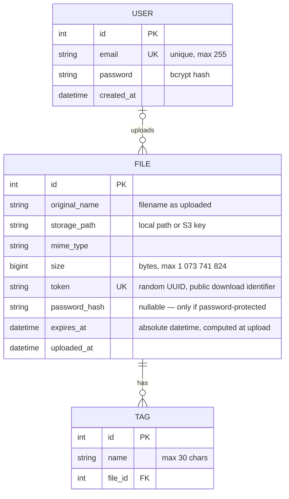

# DataShare — Conceptual Data Model (MCD)

## Diagram

**Cardinalities**

| Association | Reading |
|-------------|---------|
| USER `\|o` — `o{` FILE | A file belongs to **0 or 1** user (0 = anonymous upload). A user owns **0 or many** files. |
| FILE `\|\|` — `o{` TAG | A tag belongs to **exactly 1** file. A file has **0 or many** tags. |

**Constraint not expressible in diagram:** `UNIQUE(file_id, name)` on TAG — no duplicate tag name per file.

---

## Design Choices & Rationale

### 1. Three entities only — no over-engineering
The spec maps cleanly to three concepts: **who uploads** (USER), **what is shared** (FILE), and **how it is labelled** (TAG). No other entity is needed for the MVP or the optional features.

### 2. `user_id` is nullable on FILE
US07 (anonymous upload) allows files with no owner. Rather than a separate `AnonymousFile` table, a nullable FK on FILE covers both cases with a single query interface. The business rule "anonymous files have no history" is enforced at the API layer, not the schema.

### 3. `token` is separate from `id`
The spec requires a non-predictable download identifier. Using the auto-increment `id` in the URL would expose the total number of uploads and allow enumeration attacks. A separate UUID field (`token`) is the public-facing identifier; `id` stays internal.

### 4. `storage_path` abstracts local vs S3
Whether storage is local (`/uploads/2024/abc123.pdf`) or AWS S3 (`uploads/abc123/report.pdf`), a single VARCHAR column holds the path or key. Switching storage backends only requires changing the Symfony service — the schema stays untouched.

### 5. `expires_at` stored as absolute datetime
Computed once at upload (`uploaded_at + chosen_days`), this simplifies every subsequent check to a single `WHERE expires_at < NOW()`. No recalculation needed on reads, and the daily cron purge is a trivial query.

### 6. `password_hash` on FILE, not a separate table
Password protection is an optional attribute of a file, not a relationship between entities. A nullable column avoids an extra JOIN on every file read and keeps the model simple. The hash uses the same bcrypt algorithm as user passwords.

### 7. TAG is a dependent entity of FILE (one-to-many, not many-to-many)
Tags in this spec are **labels on a specific file**, not a shared vocabulary reused across files. There is no tag library in the spec and no tag management screen. A simple `file_id FK` on TAG is sufficient; a pivot table would imply reusability that does not exist here. The `UNIQUE(file_id, name)` constraint enforces the "no duplicates per file" rule at the database level.

### 8. No `DownloadLog` entity
The spec does not require tracking how many times a file was downloaded, by whom, or when. Adding it would be premature — it can always be introduced later without breaking the current schema.

### 9. `size` stored in bytes as BIGINT
1 GB = 1 073 741 824 bytes, which fits in a 32-bit integer (max ~2.1 GB), but BIGINT future-proofs the column if the size limit is ever raised. Storage cost is negligible (8 bytes per row).

---

## Symfony / PostgreSQL Mapping Notes

- `USER` → Doctrine entity `User`, table `users`
- `FILE` → Doctrine entity `File`, table `files`
- `TAG` → Doctrine entity `Tag`, table `tags`
- `token` → generated with `Symfony\Component\Uid\Uuid::v4()` at upload time
- `password` (User) → hashed with `PasswordHasherInterface` (bcrypt, cost 12)
- `password_hash` (File) → same hasher, stored only when provided
- Expiration cron → `symfony console app:purge-expired` command triggered by a system cron daily
- JWT auth → `lexik/jwt-authentication-bundle`
