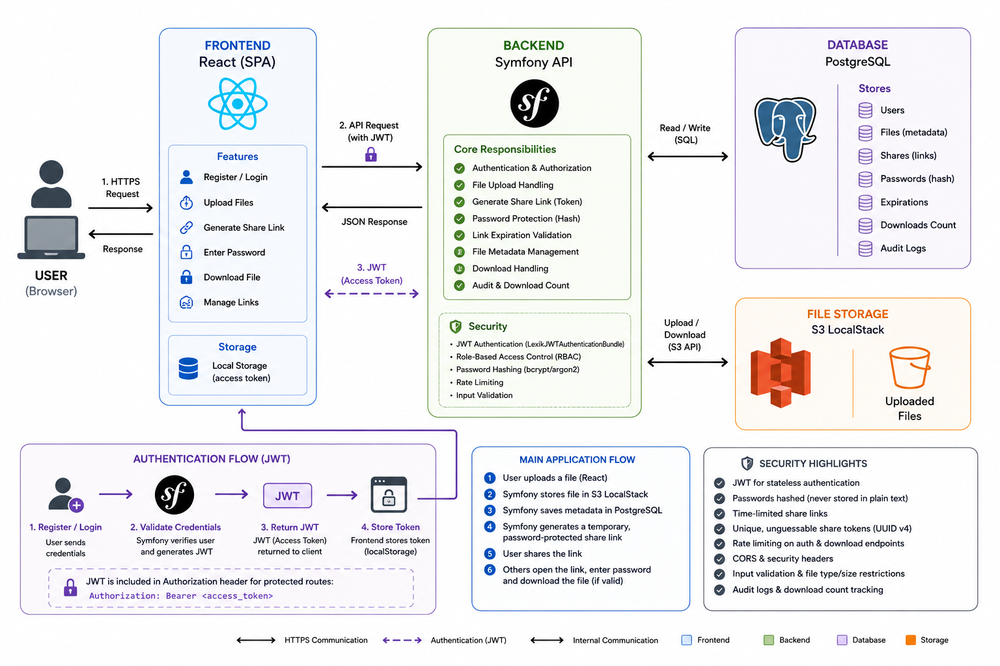

# DataShare

A file-sharing web application where users — anonymous or registered — can upload files and share them via temporary, password-protected download links.

## Features

- Upload files (authenticated or anonymous) up to **1 GB**
- Shareable download links with **1–7 day expiration**
- Optional **password protection** per file
- **File history** and manual deletion for registered users
- **Tag management** (add / remove labels on files)
- Automatic daily purge of expired files
- JWT-based authentication

## Tech Stack

| Layer     | Technology         |
|-----------|--------------------|
| Back-end  | PHP · Symfony      |
| Front-end | TypeScript · React |
| Database  | PostgreSQL         |
| Auth      | JWT (`lexik/jwt-authentication-bundle`) |
| Storage   | Local filesystem / AWS S3 |

## Documentation

| File | Description |
|------|-------------|
| [`SPEC_SUMMARY.md`](SPEC_SUMMARY.md) | MVP user stories and technical constraints |
| [`API_CONTRACT.md`](API_CONTRACT.md) | Full REST API reference (endpoints, payloads, error codes) |
| [`MCD.md`](MCD.md) | Conceptual Data Model — entities, relationships, design rationale |
| [`MLD.md`](MLD.md) | Logical Data Model — table definitions, indexes, integrity rules |
| [`documentation/specification.pdf`](documentation/specification.pdf) | Original project specification |
| [`journal-ia.md`](journal-ia.md) | AI tool usage log |

## API Overview

Base URL: `/api/v1`  
Auth: `Authorization: Bearer <token>`

| Method | Path | Auth | Description |
|--------|------|------|-------------|
| `POST` | `/auth/register` | Public | Create account |
| `POST` | `/auth/login` | Public | Login, get JWT |
| `POST` | `/files` | Auth | Upload file |
| `POST` | `/files/anonymous` | Anon only | Upload without account |
| `GET` | `/files` | Auth | Upload history |
| `GET` | `/files/{token}` | Public | File metadata |
| `GET` | `/files/{token}/download` | Public | Download file |
| `DELETE` | `/files/{id}` | Auth | Delete a file |
| `POST` | `/files/{id}/tags` | Auth | Add tag |
| `DELETE` | `/files/{id}/tags/{tagId}` | Auth | Remove tag |

See [`API_CONTRACT.md`](API_CONTRACT.md) for full request/response schemas.

## Data Model

Three entities: **User**, **File**, **Tag**.

- A file belongs to 0 or 1 user (0 = anonymous upload)
- A tag belongs to exactly 1 file; tag names are unique per file
- Download tokens are UUID v4 — non-guessable, separate from internal IDs

See [`MCD.md`](MCD.md) and [`MLD.md`](MLD.md) for full diagrams and rationale.

## Getting Started

> Setup instructions will be added once the project scaffold is in place.

## License

MIT
